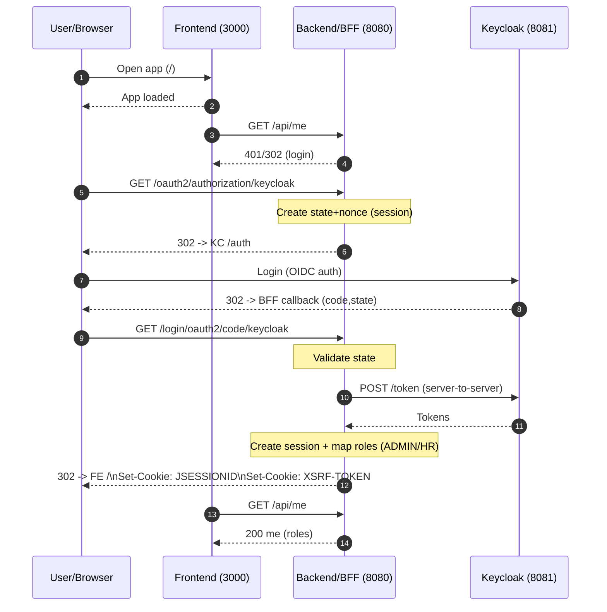
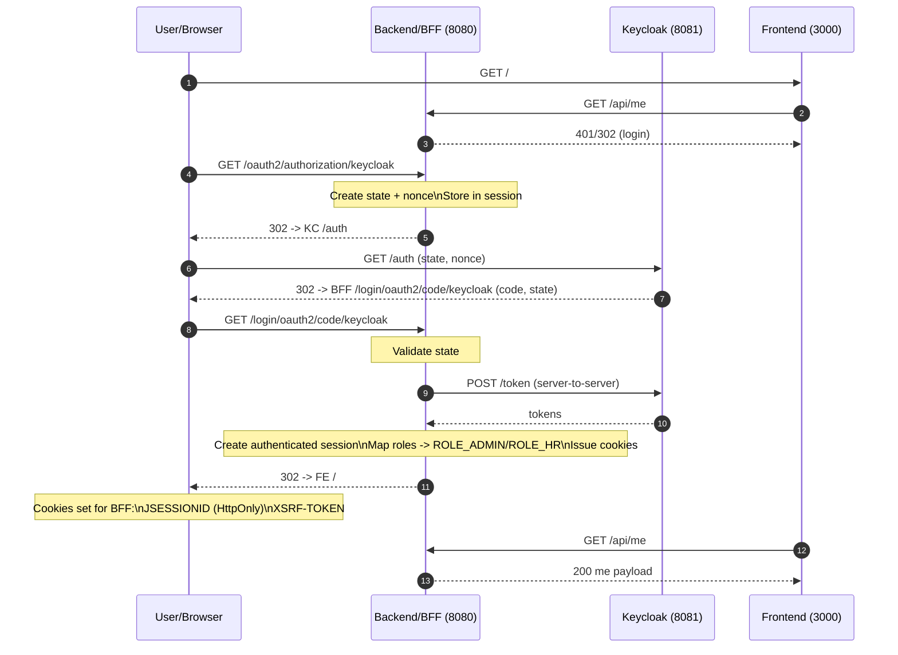
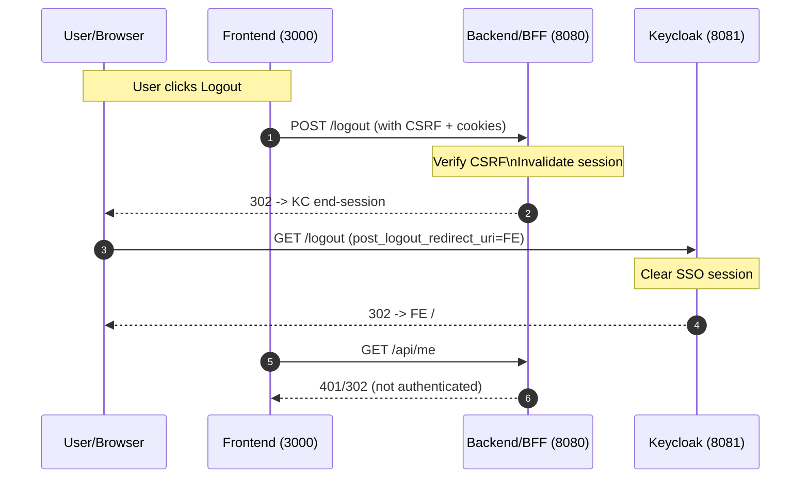

# BFF + OIDC (Keycloak) + Session Cookies — Login/Logout Flow (Spring Boot 4 + Vue)

Tento projekt používa architektúru **BFF (Backend For Frontend)** so **server-side session** a **OIDC loginom cez Keycloak**.  
Frontend (Vue) **nepoužíva JWT tokeny** na autentifikáciu — autentifikácia je riešená cez **HttpOnly session cookie**.

---

## Komponenty a porty

- **Frontend (Vue)**: `http://localhost:3000`
- **Backend / BFF (Spring Boot 4.0.0)**: `http://localhost:8080`
- **Keycloak (OIDC Provider)**: `http://localhost:8081`

---

## Prečo BFF + session cookies (bez JWT na FE)

### Hlavné dôvody
- **Žiadne access/refresh tokeny v prehliadači** (žiadne `localStorage`, `sessionStorage`).
- **Client secret ostáva na serveri** (nikdy nejde do JS bundle).
- **CSRF je riešené štandardne** (XSRF cookie + header).
- **Jednoduchý runtime model**: backend autorizuje requesty podľa session.

### Bezpečnostný profil
- Pri “JWT v storage” platí: **XSS → krádež tokenu → použitie mimo browsera** (často najhorší scenár).
- Pri BFF session: XSS je stále problém, ale útočník typicky nezíska “prenášateľný bearer token”.
- Preto v PROD je kľúčové mať silné XSS mitigácie (najmä CSP bez `unsafe-inline`).

---

# Login flow (podrobne)

Používame **OAuth2 Authorization Code Flow** s OIDC, kde OAuth klient je **backend** (nie frontend).

## Krokový popis (čo sa deje)
1. Používateľ otvorí frontend (`/`).
2. Frontend zavolá `GET /api/me` s `credentials: include`.
3. Backend zistí, že user nie je autentifikovaný → vráti redirect na OIDC login.
4. Browser ide na backend endpoint `/oauth2/authorization/keycloak`.
5. Backend vygeneruje `state` a `nonce`, uloží ich server-side (session) a redirectne na Keycloak `/auth`.
6. Keycloak spraví login (UI/SSO).
7. Keycloak redirectne späť na backend callback `/login/oauth2/code/keycloak?code=...&state=...`.
8. Backend overí `state`, potom spraví **server-to-server** výmenu `code → tokeny` (Token endpoint).
9. Backend vytvorí autentifikovanú session (SecurityContext v session), namapuje roly z claimu `roles`.
10. Backend redirectne späť na frontend (`APP_FRONTEND_URL`).
11. Frontend znova zavolá `/api/me` a dostane user info + roly.

---

## Login flow — “klasický” diagram (Mermaid)

> Ak tvoj renderer nepodporuje Mermaid, nižšie je aj textová verzia.

---

## Login flow — textová verzia (HTTP/redirect reťazec)

---

# Logout flow (podrobne)

Logout je kombinácia:
- lokálneho logoutu (invalidate session v BFF)
- SSO logoutu (Keycloak end-session / RP-initiated logout)

## Krokový popis
1. User klikne Logout vo FE.
2. FE pošle `POST /logout` na BFF, pridá:
   - `Cookie: JSESSIONID=...`
   - `Header: X-XSRF-TOKEN: <hodnota z cookie XSRF-TOKEN>`
3. BFF overí CSRF token.
4. BFF invaliduje session.
5. BFF redirectne browser na Keycloak logout endpoint s `post_logout_redirect_uri` späť na FE.
6. Keycloak zruší SSO session a redirectne späť na FE.

---

## Logout flow — diagram (Mermaid)

---

# Variant A: Role mapping (UPPERCASE)

- Keycloak claim: `roles` (napr. `["admin","hr"]`)
- Backend mapuje na authorities:
  - `ROLE_ADMIN`
  - `ROLE_HR`
- `GET /api/me` vracia:
  - `roles: ["ADMIN","HR"]`

### Backend authorization príklady
- `.requestMatchers("/api/admin/**").hasRole("ADMIN")`
- `.requestMatchers("/api/hr/**").hasAnyRole("HR","ADMIN")`

---

# DEV vs PROD — tabuľky (cookies, CSRF, CORS, CSP, HSTS)

## 1) Cookies (JSESSIONID, XSRF-TOKEN)

| Položka | DEV | PROD | Prečo |
|---|---|---|---|
| `JSESSIONID` `HttpOnly` | ✅ `true` | ✅ `true` | JS ho nevie čítať → menší dopad XSS na krádež session. |
| `JSESSIONID` `Secure` | ⚠️ `false` (ak bez TLS) | ✅ `true` | Cookie iba cez HTTPS. |
| `JSESSIONID` `SameSite` | ✅ `Lax` | ✅ `Lax` (zvyčajne) | Funguje s OIDC redirectmi + brzdí veľa CSRF scenárov. |
| `XSRF-TOKEN` `HttpOnly` | ❌ `false` | ❌ `false` | FE musí token čítať a poslať v headeri. |
| `XSRF-TOKEN` `Secure` | ⚠️ `false` (ak bez TLS) | ✅ `true` | Ochrana pred odpočúvaním. |
| `XSRF-TOKEN` `SameSite` | ✅ `Lax` | ✅ `Lax` | Konzistentné s OIDC flow. |

---

## 2) CSRF (Spring Security)

| Položka | DEV | PROD | Prečo |
|---|---|---|---|
| CSRF zapnuté | ✅ | ✅ | Pri session cookies je CSRF ochrana nutná. |
| Ignorovať OAuth callbacky (`/oauth2/**`, `/login/oauth2/**`) | ✅ | ✅ | Súčasť OIDC flow. |
| Ignorovať `/logout` | ❌ | ❌ | Inak “logout CSRF” (nútiteľné odhlásenie). |
| FE posiela `X-XSRF-TOKEN` | ✅ | ✅ | Na POST/PUT/DELETE (a aj logout). |

---

## 3) CORS

| Položka | DEV | PROD | Prečo |
|---|---|---|---|
| `allowedOrigins` | ✅ `http://localhost:3000` | ✅ konkrétna FE doména | Pri cookies nemôže byť `*`. |
| `allowCredentials` | ✅ `true` | ✅ `true` | Potrebné pre session cookie. |
| `allowedHeaders` | ✅ + `X-XSRF-TOKEN` | ✅ + `X-XSRF-TOKEN` | CSRF header musí prejsť. |
| `allowedMethods` | ✅ podľa potreby | ✅ podľa potreby | Least privilege. |

---

## 4) CSP (Content-Security-Policy)

| Direktíva | DEV | PROD | Prečo |
|---|---|---|---|
| `default-src` | `'self'` | `'self'` | Základný “deny by default” prístup. |
| `script-src` | často `'unsafe-inline'` kvôli HMR | ✅ bez `unsafe-inline` | Kľúčové proti XSS. |
| `style-src` | často `'unsafe-inline'` | ✅ bez `unsafe-inline` | Znižuje riziko injection. |
| `connect-src` | + `ws://localhost:3000` | len potrebné domény | HMR websocket iba v DEV. |
| `frame-ancestors` | `'none'` | `'none'` | Anti-clickjacking. |
| `object-src` | voliteľné | ✅ `'none'` | Zakáže pluginy/objekty. |
| `base-uri` | voliteľné | ✅ `'self'` | Bráni útokom cez `<base>`. |

---

## 5) HSTS (Strict-Transport-Security)

| Položka | DEV | PROD | Prečo |
|---|---|---|---|
| HSTS | ❌ | ✅ (ak HTTPS) | Vynúti HTTPS, bráni downgrade. |
| `max-age` | - | napr. `31536000` | Typicky 1 rok. |
| `includeSubDomains` | - | podľa potreby | Len ak všetky subdomény sú HTTPS. |

---

# Praktické debug tipy

## Ako uvidieť redirect chain
- Browser DevTools → **Network**
- zapnúť **Preserve log**
- sledovať `302`:
  - `/oauth2/authorization/keycloak`
  - Keycloak `/auth`
  - `/login/oauth2/code/keycloak`
  - redirect späť na FE

## Ako skontrolovať cookies
- DevTools → Application/Storage → Cookies (pre `localhost:8080`)
- uvidíš:
  - `JSESSIONID` (HttpOnly)
  - `XSRF-TOKEN` (nie HttpOnly)

---

# Produkčné minimum (tl;dr)

1. ✅ HTTPS všade (alebo aspoň na edge + správne proxy nastavenia)
2. ✅ `server.servlet.session.cookie.secure=true`
3. ✅ CSP v PROD bez `unsafe-inline`
4. ✅ HSTS zapnúť (iba na HTTPS)
5. ✅ CORS len na FE doménu + `allowCredentials=true`
6. ✅ CSRF zapnuté a `/logout` CSRF-protected

---
